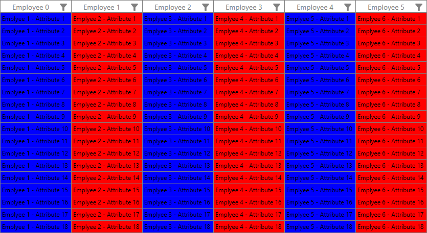
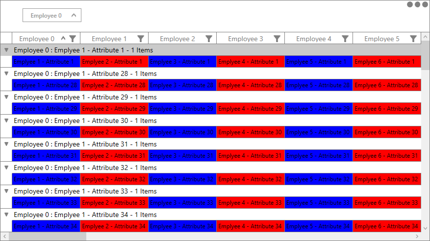

# How to apply alternate column style based on enum value in WPF DataGrid (SfDataGrid)?

## About the sample
This example illustrates how to apply alternate column style based on enum value in WPF DataGrid

By default, [WPF DataGrid](https://www.syncfusion.com/wpf-ui-controls/datagrid) (SfDataGrid) does not provide the support to apply alternate column style based on Enum value. You can apply alternative column style based on the Enum value can be used by customizing the converter to the [GridCell](https://help.syncfusion.com/cr/wpf/Syncfusion.UI.Xaml.Grid.GridCell.html) background property in [SfDataGrid](https://help.syncfusion.com/cr/wpf/Syncfusion.UI.Xaml.Grid.SfDataGrid.html).

```XML
<Window.Resources>   
       <local:DataGridCellContentToColorConverter x:Key="DataGridCellToColor"/>    
       
        <Style x:Key="cellStyle" TargetType="syncfusion:GridCell">
            <Style.Triggers>
                <DataTrigger Binding="{Binding Path=IsChecked, ElementName=StyleCheckBox,Mode=TwoWay}" Value="True">
                    <Setter Property="Background" >
                       <Setter.Value>
                         <MultiBinding Converter="{StaticResource DataGridCellToColor}">
                           <MultiBinding.Bindings>
                             <Binding RelativeSource="{RelativeSource Mode=Self}"/>
                             <Binding Path ="ColumnBase.ColumnIndex"  RelativeSource="{RelativeSource Self}"/>
                             <Binding Path ="ColumnBase.RowIndex"  RelativeSource="{RelativeSource Self}"/>
                             <Binding ElementName="syncgrid"/>
                           </MultiBinding.Bindings>
                         </MultiBinding>
                       </Setter.Value>
                   </Setter>
                </DataTrigger>
            </Style.Triggers>
        </Style>
</Window.Resources>

```

```C#

public class DataGridCellContentToColorConverter : IMultiValueConverter
{
        public object Convert(object[] values, Type targetType, object parameter, CultureInfo culture)
        {
            //get the GridCell proeprty 
            var cell = values[0] as GridCell;

            //get the columnIndex value  
            var columnIndex = (int)values[1];

            //get the rowIndex value  
            var rowIndex = (int)values[2];

            //get the SfDataGrid 
            var dataGrid = values[3] as SfDataGrid;

            //Returns start column index of the VisibleColumn. 
            var startIndex = dataGrid.ResolveToStartColumnIndex();
            columnIndex = columnIndex - startIndex;

            // Get the resolved current record index  
            var recordIndex = dataGrid.ResolveToRecordIndex(rowIndex);

            object data = null;
            if (values[0] != null && values[1] != null)
            {
                //check if datagrid grouped or not 
                if (dataGrid.View.TopLevelGroup != null)
                {
                    // Get the current row record while grouping 
                    var record = dataGrid.View.TopLevelGroup.DisplayElements[recordIndex];

                    if (!record.IsRecords) //skips caption summary, group summary rows 
                        return DependencyProperty.UnsetValue;

                    var dataCell = (record as RecordEntry).Data;

                    data = (dataCell as DataRowView).Row.ItemArray[columnIndex];
                }
                else
                {
                    data = (cell.DataContext as DataRowView).Row.ItemArray[columnIndex];
                }

                //type case to get the comparison enum value                 
                var employeeComparison = (data as Employee).ComparisonState;

                if (employeeComparison == ComparisonStateEnum.DIFFERENT)
                {
                    return new SolidColorBrush(Colors.Red);
                }
                else if (employeeComparison == ComparisonStateEnum.EQUAL)
                {
                    return new SolidColorBrush(Colors.Blue);
                }
                else
                    return DependencyProperty.UnsetValue;

            }
            return DependencyProperty.UnsetValue;

        }
        public object[] ConvertBack(object value, Type[] targetTypes, object parameter, CultureInfo culture)
        {
            throw new NotImplementedException();
        }
}

```

The following screenshot shows the applied alternate column style based on Enum value in [SfDataGrid](https://help.syncfusion.com/cr/wpf/Syncfusion.UI.Xaml.Grid.SfDataGrid.html),


The following screenshot shows the alternate column style applied while grouping in [SfDataGrid](https://help.syncfusion.com/cr/wpf/Syncfusion.UI.Xaml.Grid.SfDataGrid.html),



Take a moment to peruse the [WPF DataGrid - Conditional Styling](https://help.syncfusion.com/wpf/datagrid/conditional-styling) documentation, where you can find about Styling with code examples.

Please refer this [link](https://www.syncfusion.com/wpf-ui-controls/datagrid) to know about the essential features of WPF DataGrid.

## Requirements to run the demo
Visual Studio 2015 and above versions
